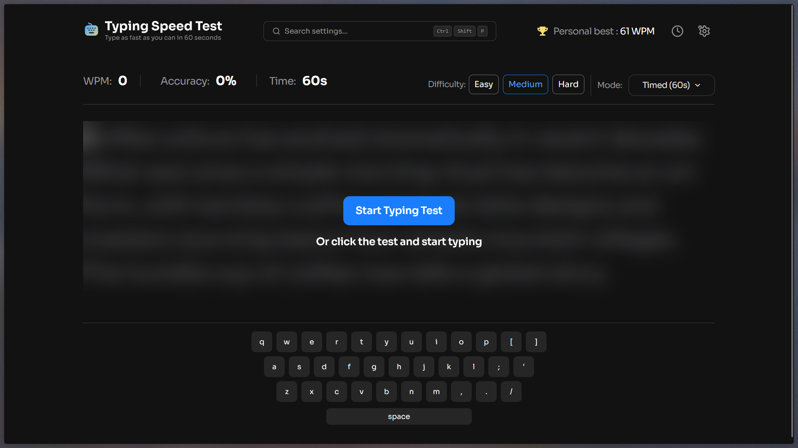
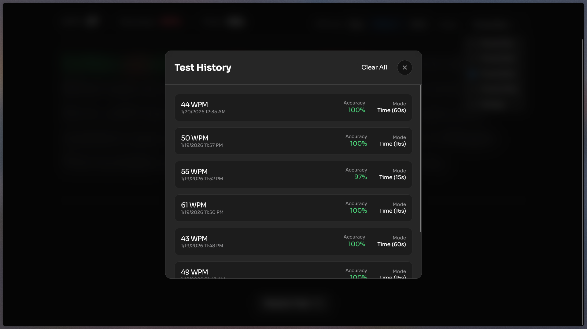
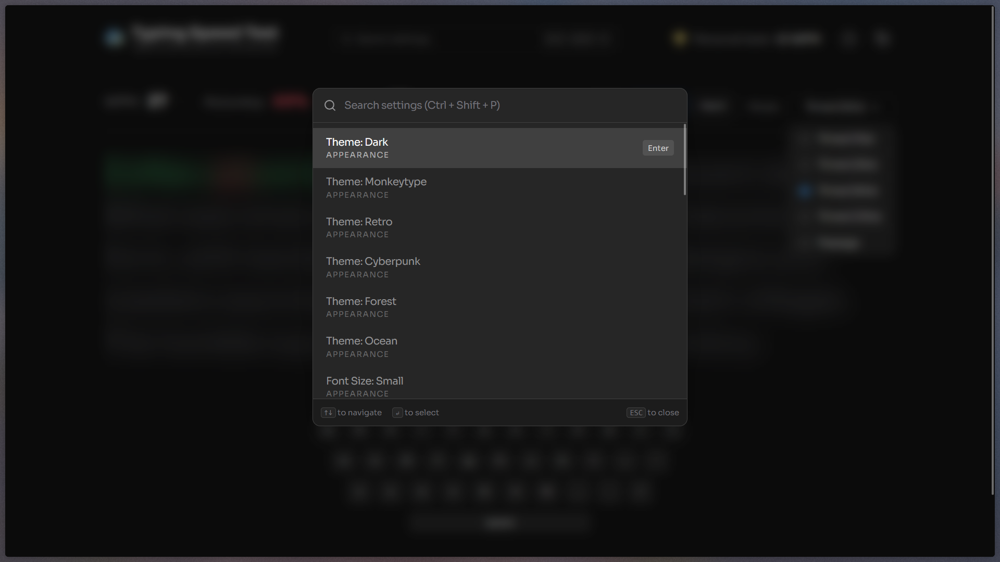
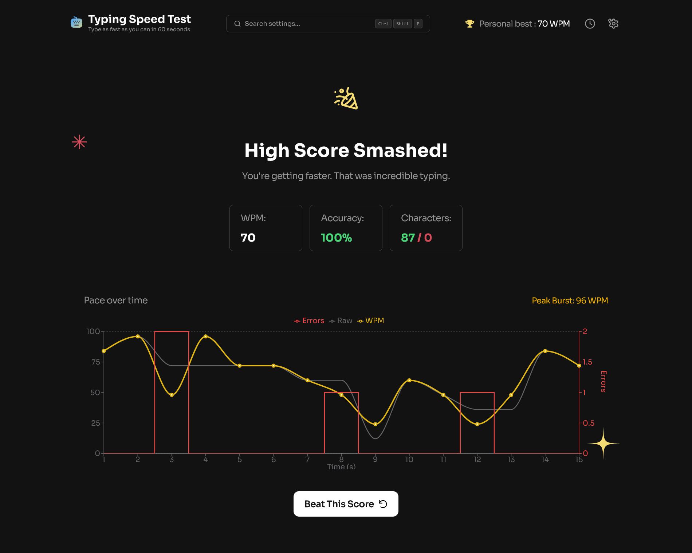

# Frontend Mentor - Typing Speed Test solution

This is a solution to the [Typing Speed Test challenge on Frontend Mentor](https://www.frontendmentor.io/challenges/typing-speed-test). Frontend Mentor challenges help you improve your coding skills by building realistic projects.

## Table of contents

- [Frontend Mentor - Typing Speed Test solution](#frontend-mentor---typing-speed-test-solution)
  - [Table of contents](#table-of-contents)
  - [Overview](#overview)
    - [The challenge](#the-challenge)
    - [Screenshots](#screenshots)
      - [Start Screen](#start-screen)
      - [Typing Test in Progress](#typing-test-in-progress)
      - [Detailed History](#detailed-history)
      - [Command Palette](#command-palette)
      - [Settings and Themes](#settings-and-themes)
      - [Results and Analytics](#results-and-analytics)
  - [My process](#my-process)
    - [Built with](#built-with)
    - [Key Features](#key-features)
    - [What I learned](#what-i-learned)
    - [Continued development](#continued-development)
    - [Useful resources](#useful-resources)
  - [Author](#author)

## Overview

### The challenge

Users should be able to:

- View the optimal layout for the interface depending on their device's screen size
- See hover and focus states for all interactive elements on the page
- Take a typing speed test with real-time feedback (WPM, Accuracy)
- Choose between different test modes (Time-bound or Passage-bound)
- Customize the experience with various themes, font sizes, and sounds
- View detailed results with WPM charts and character-level accuracy
- Track progress through a persistent test history
- Use a Command Palette for quick navigation and settings

### Screenshots

#### Start Screen



#### Typing Test in Progress


#### Detailed History



#### Command Palette



#### Settings and Themes


#### Results and Analytics



## My process

### Built with

- [React 19](https://reactjs.org/) - Component-based UI library
- [Vite](https://vitejs.dev/) - Next-generation frontend tooling
- [Tailwind CSS 4](https://tailwindcss.com/) - Utility-first CSS framework with modern features
- [React Router 7](https://reactrouter.com/) - Declarative routing for React applications
- [Zustand](https://github.com/pmndrs/zustand) - Minimalist and persistent state management
- [Recharts](https://recharts.org/) - Composable charting library
- [Canvas-confetti](https://www.npmjs.com/package/canvas-confetti) - For celebration animations
- Semantic HTML5 markup
- Mobile-first workflow

### Key Features

- **Multiple Typing Modes**: Support for "Time" (fixed duration) and "Passage" (type the whole text) modes.
- **Dynamic Content**: Categories including General, Programming, Quotes, Numbers, and Custom text input.
- **Theming System**: 6 pre-built themes (Dark, Monkeytype, Retro, Cyberpunk, Forest, Ocean).
- **Audio Feedback**: Custom typing sounds (Mechanical, Soft, Silent) with volume control.
- **Visual Customization**: Toggleable keyboard heatmap, multiple caret styles, and adjustable font sizes.
- **Persistence**: All settings and test history are saved to `localStorage` using Zustand middleware.
- **Advanced Analytics**: Real-time WPM calculation, accuracy tracking, and a detailed performance chart.

### What I learned

Working on this project reinforced my understanding of complex state management and real-time UI updates. One of the highlights was implementing the typing logic and caret positioning:

```jsx
// Caret positioning logic using useLayoutEffect for smooth transitions
useLayoutEffect(() => {
  if (activeCharRef.current && containerRef.current) {
    const activeRect = activeCharRef.current.getBoundingClientRect();
    setCaretPos({
      top: activeCharRef.current.offsetTop,
      left: activeCharRef.current.offsetLeft,
      height: activeRect.height,
      width: activeRect.width,
    });
  }
}, [userInput.length, fontSize]);
```

I also learned how to leverage Tailwind CSS 4's new features for theming by using data attributes:

```css
/* Theme system using CSS variables */
[data-theme="cyberpunk"] {
  --color-neutral-900: #000b1e;
  --color-neutral-400: #ffee00;
  --color-green-500: #00ff9f;
  --color-red-500: #ff003c;
}
```

### Continued development

In future iterations, I plan to add:

- Multiplayer racing modes using WebSockets.
- More advanced keyboard heatmap with heat intensity levels.
- Expanded programming categories with more languages.

### Useful resources

- [Zustand Middleware Documentation](https://github.com/pmndrs/zustand#middleware) - Essential for implementing the persistent settings.
- [Monkeytype](https://monkeytype.com/) - Provided great inspiration for the UI and theming system.

## Author

- Frontend Mentor - [@Joseph-Abdullaah](https://www.frontendmentor.io/profile/Joseph-Abdullaah)
